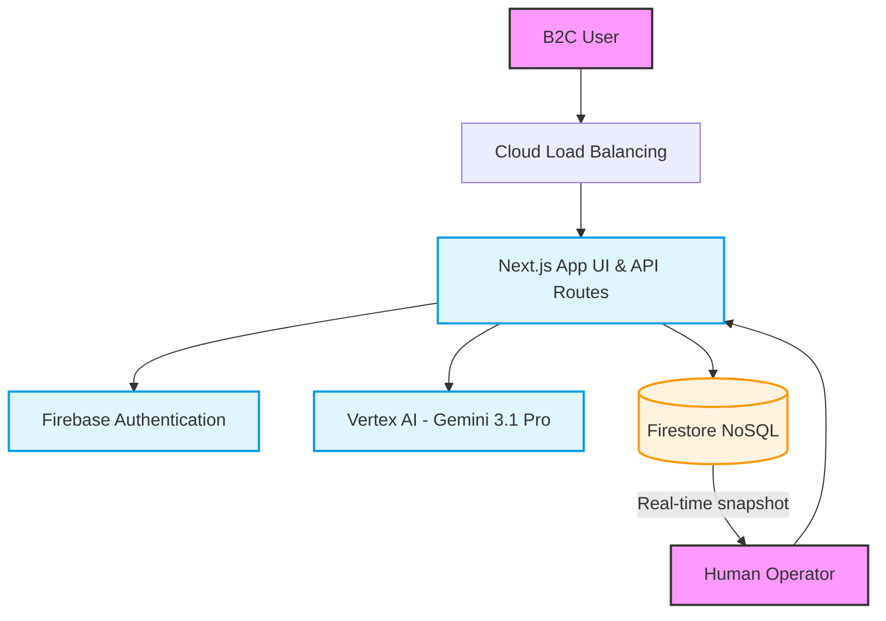
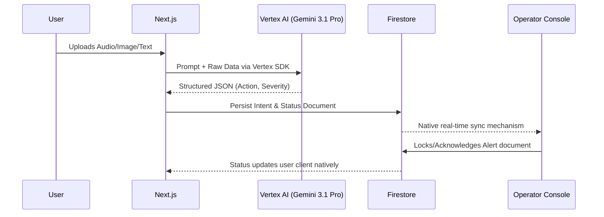
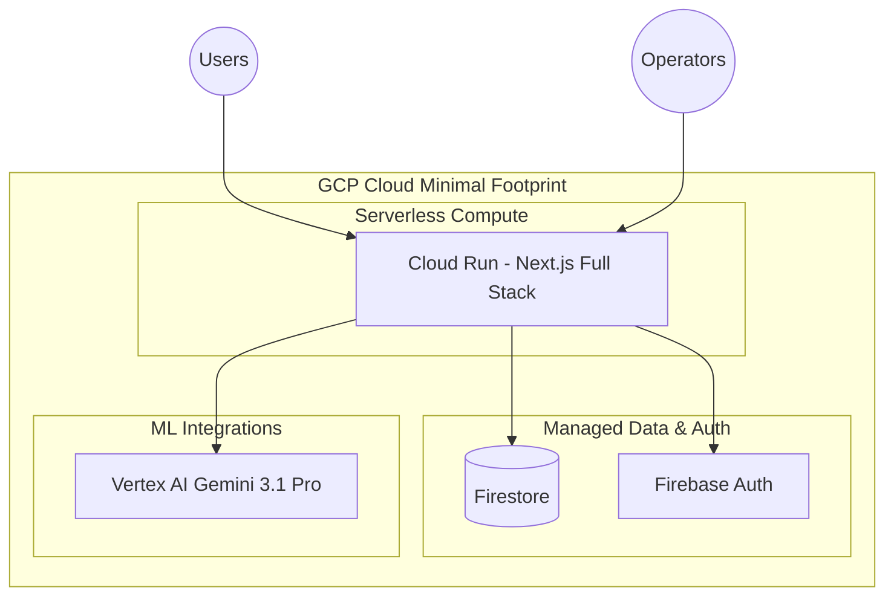

# Universal Bridge Architecture Design

## 1. Executive Summary
This architecture provides a scalable, secure, and privacy-first foundation for a "Universal Bridge" application. It ingests chaotic, multi-modal B2C data (voice, text, images, medical context) and leverages Gemini 3.1 Pro via Vertex AI to extract structured, actionable intent. This verified intent is then pushed in real-time to a human-in-the-loop operator console. By heavily limiting the initial GCP footprint to just Cloud Run, Vertex AI, and Firestore/Firebase, the architecture enables a small engineering team to deliver a highly reliable MVP quickly, minimizing operational overhead while deferring complex enterprise services to later phases.

## 2. Assumptions and Constraints
**Explicit Assumptions:**
*   Users have access to modern web browsers (mobile or desktop).
*   The human operators are trained professionals working from a centralized or secure decentralized console.
*   Gemini 3.1 Pro provides sufficient mathematical, reasoning, and multi-modal capabilities for the target use cases.

**Known Constraints:**
*   **Latency limitation:** The system must round-trip the user input, LLM processing, and operator alert within 4-5 seconds.
*   **Team Size:** Operator team and engineering team are extremely small; a heavily minimized GCP service footprint is required for MVP.
*   **Platform:** Ecosystem is constrained to Google Cloud Platform (GCP).

**Unresolved Risks:**
*   LLM hallucination in extremely edge-case medical/emergency scenarios.
*   The exact volume of concurrent "spike" traffic during localized emergencies.

**How these affect the design:**
Fully managed serverless execution (Cloud Run + Firestore) is chosen to handle unpredictable spikes without active operator intervention. Advanced and complex GCP services (Pub/Sub, Cloud SQL, DLP) are deferred.

## 3. Architecture Principles
*   **Secure by Default:** All internal communication is authenticated (IAM).
*   **Privacy by Design:** System prompts strictly instruct Gemini 3.1 Pro to discard non-essential PII. Native Cloud DLP is deferred but planned.
*   **Lean Infrastructure:** Limit GCP services used to the absolute minimum required to prove the life-saving MVP.
*   **Scalability & Fault Isolation:** API layer and LLM orchestration are containerized and stateless.
*   **Observable Systems:** Basic trace coverage for external AI calls to audit delays.
*   **Cost-Awareness:** Scale-to-zero capabilities for development and non-peak hours.
*   **Accessibility & UX Trust:** The B2C UI must be perfectly clear, accessible (WCAG 2.1 AA), and calming.

## 4. Stakeholder Viewpoint Synthesis
*   **Senior Staff Architect:** Focuses on minimizing the initial component count while keeping the path to event-driven architectures (Pub/Sub) open for the future.
*   **Solution Architect:** Prioritizes leveraging the native Vertex AI Gemini 3.1 Pro integration while deferring complex networking/security tools like Cloud Armor until Phase 2.
*   **Staff Engineer:** Cares about the local DevEx; fewer GCP services means a much easier local Docker-compose environment.
*   **Product Manager:** Validates that the 4-5s latency SLA is met to ensure users feel "heard" immediately.
*   **UX Design Manager:** Advocates for a calming, frictionless B2C UI and a high-density dashboard for operators.
*   **Senior Staff Frontend Engineer:** Drives the choice of Next.js with Firebase Client SDK to skip building an intermediate WS/SSE tier for real-time reactivity.
*   **Security/Privacy:** Ensures prompt optimization acts as an initial privacy shield, knowing enterprise DLP tools will follow as team bandwidth increases.
*   **SRE/Platform:** Demands Terraform for the minimal stack, ensuring the path from 3 services to 15 services is governed as code.

## 5. High-Level Architecture

### Layered Architecture Diagram

### Request Flow Diagram (Critical Path)

### Deployment Topology Diagram

## 6. Technology Stack Recommendations

### Frontend & API Layer
*   **Primary Choice:** Next.js (React) deployed on Cloud Run.
*   **Version:** Next.js 14+ (App Router).
*   **Why:** Combining the UI and API logic into a single Next.js monolith on Cloud Run limits the GCP service footprint. No need for a separate FastAPI service right now.

### Identity Provider
*   **Primary Choice:** Firebase Authentication.
*   **Why:** Serverless, instant integration, perfectly paired with Firestore rules.

### Database & Real-time Sync
*   **Primary Choice:** Firestore (Datastore mode Native).
*   **Why:** Replaces Cloud SQL (too heavy), Redis (too complex), and custom SSE servers (too much maintenance). Firestore natively handles real-time alerts to the operator dashboard via client SDK snapshots.

### Object Storage
*   **Primary Choice:** Google Cloud Storage (GCS).

### ML Orchestration
*   **Primary Choice:** Vertex AI.
*   **Version:** Gemini 3.1 Pro.
*   **Why:** Enterprise-grade boundaries, incredible reasoning for complex multi-modal inputs, rendering separate OCR or Whisper APIs unnecessary.

## 7. Security and Data Protection Design

*   **Authentication & Authorization:** Implemented via Firebase Auth. Firestore rules physically prevent B2C users from reading operator queues.
*   **Encryption at Rest & Transit:** Native GCP defaults.
*   **Privacy Controls (MVP Phase):** We will heavily rely on Gemini 3.1 Pro's system instructions to format and strip data out on the return payload. *Note: Cloud DLP is deferred to Phase 2 to limit the active GCP services during MVP.*
*   **Data Lifecycle:** Firestore TTL (Time To Live) policies will automatically purge raw documents after 72 hours.

## 8. Frontend Architecture
*   **Application Structure:** Next.js App Router for full-stack delivery.
*   **Real-time Approach:** Firebase JS SDK used on the operator's client to subscribe to the `/intents` collection, achieving real-time without managing WebSockets or internal SSE infrastructure.

## 9. Backend Architecture
*   **Service Boundaries:** Pure Monolith. Everything lives in the Next.js `app/api` routes or Server Actions.
*   **API Style:** Server Actions / GraphQL for internal use.
*   **Background Jobs:** Deferred. The user will wait synchronously for the LLM resolution, keeping architecture bone-dry.

## 10. Data Architecture
*   **Database:** Firestore.
*   **Schema Strategy:**
    *   `/users/{userId}`
    *   `/intents/{intentId}` (Contains raw_text, parsed_json_from_gemini, status: pending/acknowledged)

## 11. Infrastructure and Platform Design
*   **Cloud Topology:** Single Region.
*   **Platform Choice:** Single Cloud Run instance.
*   **IaC:** Terraform manages just the GCP Project, Cloud Run service, and Firestore DB. 

## 12. Monitoring, Observability, and Operations
*   **Telemetry:** GCP Cloud Logging natively attached to Cloud Run. No custom OpenTelemetry layers for MVP.
*   **Alerting Framework:** Built-in Cloud Run metrics monitoring 5xx error rates as the sole PagerDuty trigger.

## 13. Scalability Plan to Millions of Users
*   **MVP (Current):** Next.js Monolith + Firestore + Vertex AI Gemini 3.1 Pro. Highly limited footprint.
*   **Growth Stage:** Split Next.js into separate FastAPI microservice. Introduce Cloud DLP for rigid privacy.
*   **Large-Scale:** Introduce Cloud Pub/Sub for asynchronous processing and Cloud Armor for edge WAF protection. Transition to multi-region global footprint.

## 14. MVP First Plan
**Goal:** Prove the core premise—messy human input converted to structured actionable alerts for an operator in under 5 seconds—with the absolute minimum Google Cloud footprint.

**What to Build Now:**
*   Next.js unified app (Consumer Web Form + Operator Feed).
*   Vertex AI Gemini 3.1 Pro SDK integration.
*   Firestore for storing intent and syncing state to operators.

**What to Defer (Limited Footprint Strategy):**
*   Dedicated Python/FastAPI microservices.
*   Cloud SQL/PostgreSQL.
*   Cloud Pub/Sub queues.
*   Cloud DLP text redaction pipelines.

## 15. Iterative Roadmap
*   **Phase 1: Lean MVP (Weeks 1-4):** Next.js on Cloud Run, Firestore, Gemini 3.1 Pro. Proving the core functionality.
*   **Phase 2: Hardening & Privacy (Weeks 5-8):** Introduce Cloud DLP to sanitize PII. Setup Terraform robustly.
*   **Phase 3: Scale & Reliability (Months 3-4):** Decouple API into Python/FastAPI. Add Cloud Pub/Sub for traffic spikes and guaranteed processing. Add Cloud Armor.

## 16. Architecture Decision Records

| Title | Decision | Reason | Consequences & Risks | Alternatives |
| :--- | :--- | :--- | :--- | :--- |
| **ADR01: Compute footprint** | Next.js Monolith on Cloud Run | Limits the GCP service surface area significantly. | Slower ML iteration vs Python, but acceptable for MVP. | Split Python/Node stack. |
| **ADR02: Database & Realtime** | Firestore Native | Combines DB and Realtime SSE infrastructure into one managed service. | Vendor lock-in; poor complex analytics. | Postgres + Redis Pub/Sub. |
| **ADR03: AI Engine** | Vertex AI Gemini 3.1 Pro | The latest flagship model handles massive context and reasoning flawlessly. | Cost overhead of Pro vs Flash. | Local Llama 3 or Gemini 1.5. |
| **ADR04: Privacy Approach** | Prompt-driven (Defer DLP) | Keeping footprint small means skipping Cloud DLP temporarily. | Higher risk of PII leakage in the ML pipeline temporarily. | Stand up Cloud DLP pipeline immediately. |
| **ADR05: Sync vs Async** | Synchronous Next.js routes | Prevents needing Cloud Tasks or Pub/Sub queues. | If Gemini takes > 10s, the client might timeout. | Cloud Pub/Sub queueing. |

## 17. Risk Register

| Risk | Likelihood | Impact | Mitigation | Owner | Phase |
| :--- | :--- | :--- | :--- | :--- | :--- |
| Gemini 3.1 Pro synchronous call timeouts under load | High | High | Strict prompt sizing to ensure fast inference; adjust Cloud Run timeout limits. | Platform | MVP |
| Exposing User PII/PHI in Firestore without Cloud DLP | Medium | Critical | Use rigid Firestore security rules and prompt the LLM to discard names locally. | Security | MVP |

## 18. Web App Evaluation Criteria

To ensure the web application meets the high standards required for critical, life-saving operations, all code and architectural updates must be continuously evaluated against the following criteria:

*   **Code Quality (Structure, Readability, Maintainability):** The Next.js monolith must employ strict linting (ESLint, Prettier). Given the single-repository structure, code separation between `(consumer)` and `(operator)` boundaries is heavily prioritized.
*   **Security (Safe and Responsible Implementation):** Implemented by strictly authenticating endpoints via Firebase Auth, using strict Firestore Client Rules, and prioritizing an upgrade path to Cloud DLP for Phase 2.
*   **Efficiency (Optimal use of Resources):** The architectural footprint is intentionally limited. Resources are optimized by collapsing UI serving, BFF APIs, and real-time syncing into as few managed GCP services as possible.
*   **Testing (Validation of Functionality):** Functionality must be validated rigorously. Since we defer queues, end-to-end browser tests mimicking latency jitter on the Gemini 3.1 Pro response are mandatory.
*   **Accessibility (Inclusive and Usable Design):** The B2C UI must be perfectly clear and accessible (WCAG 2.1 AA compliant) via screen readers, keyboard-only navigation, and high-contrast modes.
*   **Google Services (Meaningful Integration):** Purposeful limitation to high-leverage services: leveraging Vertex AI (Gemini 3.1 Pro) for deep reasoning, Firestore for dual DB/Realtime capabilities, and Cloud Run for zero-ops scaling.

## 19. Final Recommendation

**Recommended Stack:** Next.js (Full Stack App) + Firestore (Data & Sync) + Vertex AI Gemini 3.1 Pro + Cloud Run (Compute).
**Recommended Deployment:** Single-region GCP Serverless infrastructure behind standard native Load Balancing. 
**Recommended MVP Scope:** A highly constrained GCP footprint. No separate backend microservices, no separate databases, no complex streaming brokers. All logic is contained in the Next.js boundary talking directly to Vertex and Firestore.

**Biggest Trade-offs:** Deferring Cloud DLP limits our automated PII sanitization. Relying on synchronous Next.js API calls to Vertex AI introduces a risk of request timeouts under massive load compared to a Pub/Sub queue.
**Biggest Risks:** The Gemini 3.1 Pro generation time exceeding the 5-second round-trip budget requirement.
**What to validate first technically:** Can Gemini 3.1 Pro reliably process the system prompt and return the necessary JSON schema, synchronously, within 4.0 seconds?
